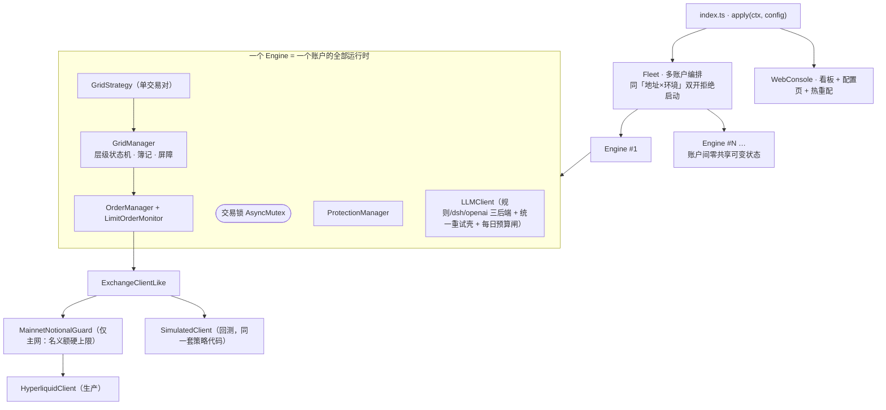
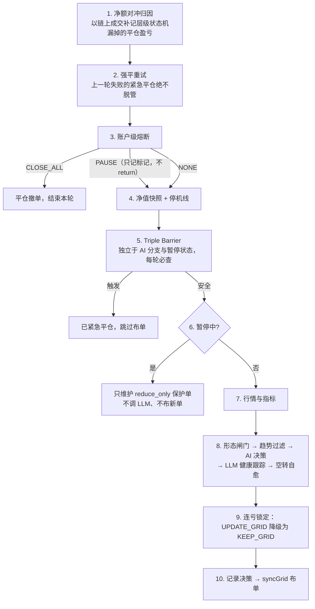
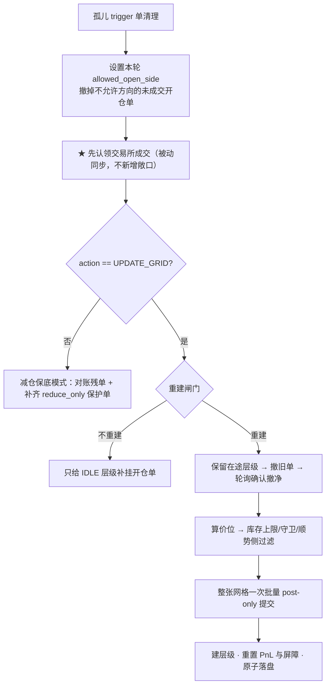
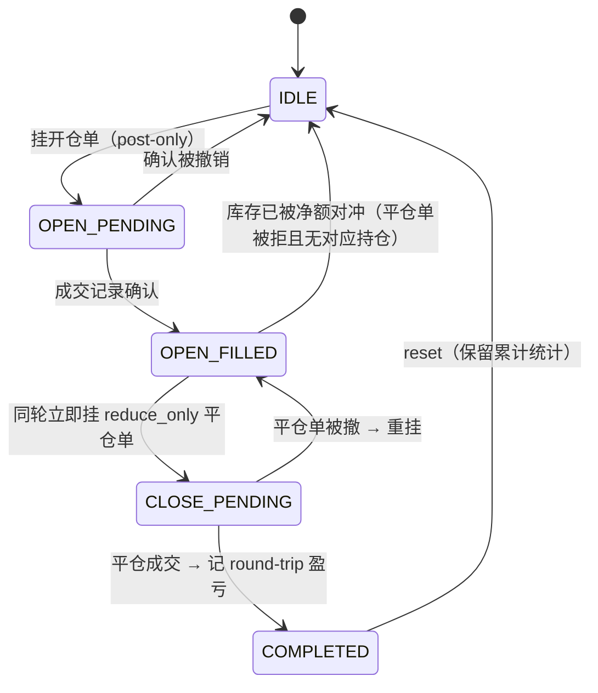

# 架构说明

## 一、部署形态

三层：**dsh 宿主**（`@deepseek-ai/cordis` 运行时，提供 `logger` / `llm` 等服务）→
**profile**（一份配置组合，决定装哪些插件）→ **本插件**。没有 Docker 形态，
「部署」就是把包装进某个 dsh profile：

```bash
dsh plugin --profile trading add dsh-plugin-quant-flow
dsh --profile trading
```

包自带 `cordis.patch.yml`（`package.json` 的 `dsh.bundle` 声明），安装后被追加进
profile 的组合层；部署侧在 profile 自己的 patch 里按 id 覆盖配置。

## 二、插件内部装配

`src/index.ts` 导出 `name` / `Config` / `apply(ctx, config)`。dsh 校验配置后调用
`apply`，插件装配大盘、启动看板，并把优雅停机注册为 `ctx.effect` disposer——
插件卸载时等进行中的撤单/布单序列走完，绝不腰斩留下裸仓。



一个账户只有**一条交易循环**（网格，固定间隔 `grid.interval_minutes`），外加 5 秒一次的
成交监控器。两者共用一把交易锁：`tryAcquire()` 非阻塞，冲突时后来者跳过本轮而不排队；
监控器是唯一会等锁的（10 秒超时）。单线程下这把锁保护的是「跨 await 的临界区」。

网格用 `trading.symbols[0]`，一个账户一套。Hyperliquid 是**单向持仓（净头寸）**，
同账户两套策略会互相净额强平、互撤保护单——需要多标的就配多账户，各自独立地址。

## 三、网格周期（顺序有真实事故背书，勿调换）



第 3 步的 `PAUSE` **只记标记不 return**：暂停的是新开仓，持仓的风控维护照常。
历史缺陷是直接 return，连带跳过屏障与保护单维护，暂停 4 小时期间亏损不封底。

第 8 步的三道闸门决定「这轮能往哪边开仓」，逐级短路：

| 闸门 | 命中后果 | 默认 |
|---|---|---|
| 形态闸门（效率比 > `range_filter_er_max`） | `allowed_open_side = none`，撤全部未成交开仓单，退出通道照常 | 0 = 关 |
| 趋势过滤（多周期强势一致 + 连续确认）+ `trend_side_only` | 仍调 LLM，但只挂顺势侧，逆势侧撤单复位 | 开 |
| 同上但 `trend_side_only: false` | 全面暂停加仓，不调 LLM | — |

`GridAgent` 的分工边界：**LLM 只回答「要不要更新形态、往哪个方向、多宽」**，
价位与金额由 `calculateGridConfig`（纯数学）推导。强制中性默认开，忽略 AI 的方向；
格数钳在 `[min_grid_num, max_grid_num]`（默认 3–10）。

### syncGrid 内部（顺序同样有事故背书）



**认领必须先于重建判定**：刚成交但本地仍是 `OPEN_PENDING` 的层级，在判定眼里就是
「还挂着的开仓单」，会被全撤全建，连同持仓与 PnL 归因一起丢弃。

**重建闸门**：首次建网格 / 挂单不足 / 参数异常 / 价格真突破旧区间（>0.5%）→ 重建；
**持有在途层级且价格仍在区间内 → 不重心化**；否则冷却期内一律不建。
层数变化不算结构性变化（LLM 层数天然抖动），方向变化算。

**布单三道过滤**（都只拦「新增敞口」，从不拦退出通道）：

| 过滤 | 作用 | 默认 |
|---|---|---|
| 库存上限 | 方向化敞口达上限即拦同向加仓 | 单侧名义额 × 0.7 |
| 库存守卫 | 绝不把开仓单挂进库存亏损区（多头均价之下不挂卖开仓单） | 恒开 |
| 顺势侧 | 强趋势中只挂顺势侧 | 开 |

post-only（Alo）：会立即成交的单被交易所拒绝而**不追价**，杜绝限价单穿价变 taker。

### 层级状态机



单向持仓下，中性网格的库存**大多被对侧格子的普通开仓单净额平掉**，根本走不到
`CLOSE_PENDING → COMPLETED`。因此风控上报以 `reconcileNettingCloses`（链上成交）为准，
层级状态机只负责写日志——两条通路绝不重复上报。

## 四、保护插件链

`IProtection` + `PROTECTION_REGISTRY` 注册即插。账户级按周期 `checkAll`，逐笔级走
`onTradeOpen` / `onTradeClose`；风控强平不上报虚假 pnl。

| 插件 | 触发 | 动作 |
|---|---|---|
| `max_drawdown` | 净值自峰值回撤超阈值 | CLOSE_ALL + 暂停 |
| `daily_loss` | 当日亏损超阈值 | 暂停开仓 |
| `consecutive_loss` | 连续亏损次数达阈值 | 锁定交易对 |

只有**确认平仓成功**才清理保护插件的持仓记录；失败则保留并登记待重试，否则
回撤保护会永远失明于那个平不掉的仓位。

## 五、交易所抽象与回测同源

`ExchangeClientLike` 是 `HyperliquidClient` 公开方法面的结构化接口；OrderManager /
GridManager / MarketDataFetcher / Engine 只依赖它。`SimulatedClient` 用历史 K 线实现
同一接口（挂单严格穿过才成交、Alo 拒单、reduce_only 钳制、触发单、资金费、维持保证金
强平），`sim/backtest.ts` 用生产同一套 Engine + GridStrategy 驱动它——**策略与簿记
代码在回测与生产之间零分叉**。

「现在几点」统一走 `utils/clock.ts`，礼貌性等待走 `utils/sleep.ts`，模拟器接管两者。
直接 `Date.now()` / `setTimeout` / `new HyperliquidClient` 会让代码在模拟器里失效。

决策后端三种（`src/llm.ts`）：`provider: rule`（默认）是规则后端——每周期给出
UPDATE_GRID，真正是否重建由 GridManager 的重建闸门决定，宽度由市场数据推导，零外部
请求，回测与生产同一实现；`dsh` 惰性取宿主服务，`openai` 直连兼容端点。三者共享同一
重试壳，故障降级路径一致。`llm` 按可选依赖处理：服务缺失时降级并连续告警，插件不拒绝
启动——风控与持仓维护必须持续运转。

LLM 在回路（dsh/openai）时挂**每日预算闸**（`LlmUsageTracker`）：按后端每一次实际请求
计数（重试每次都算），每次计数原子落盘到 `data/llm-usage.json`，UTC 跨日归零；触顶抛
`LLMBudgetError`，GridAgent 返回 `KEEP_GRID` 且 `llm_ok=true, llm_capped=true`——它是
预算刹车不是故障，既不计入连败告警也不触发兜底重建，当天只告警一次。计数单位必须是
「请求」而不是「决策」：批处理靠重试放大把共享 key 打穿、连带生产决策冻结的事故就是教训。

## 八、主网双重闸

测试网与主网只差 `HYPERLIQUID_TESTNET` 一个变量，`resolveRuntimeConfig`（启动与看板
热重配的唯一共同入口）对每个 `testnet=false` 的账户强制两条：

| 闸 | 机制 | 位置 |
|---|---|---|
| 名义额硬上限 | 环境变量给出上限；`MainnetNotionalGuard` 装饰交易所客户端，所有开仓单在 `placeLimitOrders` 前用「持仓 + 非 reduce_only 挂单 + 本批拟挂」对比上限，超限整批开仓单拒绝并打严重日志；reduce_only 永远放行；持仓/挂单查询失败 fail-closed | `src/trading/notionalGuard.ts`，`Engine.buildComponents` 接线 |
| 配置指纹确认 | 对生效配置（交易/网格/保护链/决策来源/上限/钱包地址，不含密钥）算 SHA-256，要求确认变量完全相等；不等即拒绝启动并在错误信息里给出指纹 | `src/config.ts` `configFingerprint` / `applyMainnetGates` |

闸门放在客户端层而不是策略层：开仓路径有整张批量提交和增量补挂两条，未来还可能再加，
在最底层拦就没有绕行的口子。拒绝回执与交易所拒单同构（外层 ok、`statuses[].error`），
下游 `checkOrderSuccess` 无需知道闸门存在。看板对主网账户的热重配会因指纹变化被拒
（400、不落盘），这是刻意的：主网改配置 = 改环境变量 + 重启。多账户模式下每个主网账户
独立满足（条目的 `mainnet_max_notional_env` / `mainnet_ack_env`）。

## 六、看板

`web/server.ts`（零依赖 `node:http`）+ `web/ui/` 拼装的单页应用，图表全是内联 SVG。
导航两级：**大盘**（全部账户）/ **某个账户** / **全局**（回测、配置）。
保存配置 → Schema 再校验 → 原子落盘 → `Fleet.applyConfig` 热重配（停循环 → 重建策略
→ 重启；交易所客户端与状态文件全程保留）。默认只监听 `127.0.0.1`，
设 `QUANTFLOW_WEB_TOKEN` 后全部 API 需 Bearer Token。

看错账户比看不到数据更危险，因此账户身份表达三遍：身份色、环境徽标（主网一律走
红色实盘警示态，优先级高于身份色）、浏览器标签名。盈亏色只表示数字正负，不参与身份。

客户端 JS 以字符串内联、拿不到类型保护，因此补了两层测试：`webUi.test.ts` 在
`node:vm` 里对纯渲染函数断言，`webUiFlow.test.ts` 用假 DOM + 假 fetch 真跑 `boot()`。

## 七、可观测性

`logs/main.log`（人读，50MB×3 轮转）；`logs/decisions|trades|equity/*.jsonl`
（决策审计 / 成交 pnl 归因 / 净值曲线）——JSONL 同时是看板 API 的数据源。
`trades` 记录带 `fee` 与 `crossed`（maker/taker），`scripts/attribution.mjs` 据此把
链上成交拆成 maker/taker 费用、已实现盈亏、强平与资金费。

盘口录制器（`scripts/record-book.mjs`，纯逻辑在 `scripts/book-lib.mjs`）是独立进程，
只读公开频道。按本机接收时间在 UTC 零点切日，零点后关旧日流、等文件真正关闭再流式
校验（多成员 gzip 计行 + sha256）并写 `manifest.json`，其中带每频道的消息数、最大间隔、
缺口数、丢弃数、覆盖秒数与收包延迟分位数——后者是研究阶段延迟模型的输入，覆盖秒数是
样本纳入门槛的依据。频道静默超 60 秒告警一次（预注册全部频道，连接死掉时不会一片安静）；重连以 error/close
先到者为准并带握手超时，10 分钟无消息则自行退出交由 systemd 拉起——依赖套接字事件的
看门狗曾在握手失败后卡死 15 小时；磁盘水位超限暂停最高频的 bbo 而不停 trades / l2book；
`scripts/book-verify.mjs` 逐日复核，`scripts/book-backup.sh` 每日异地 rsync（远端密钥受 rrsync 限制）。
